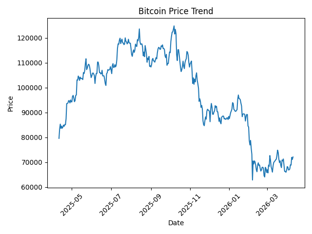
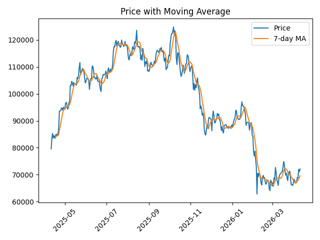
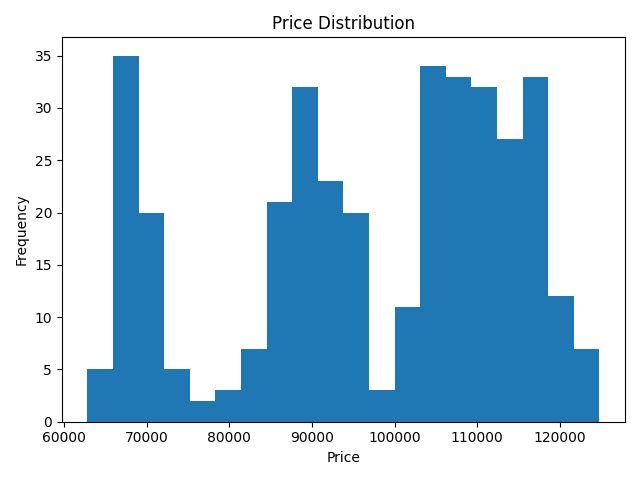
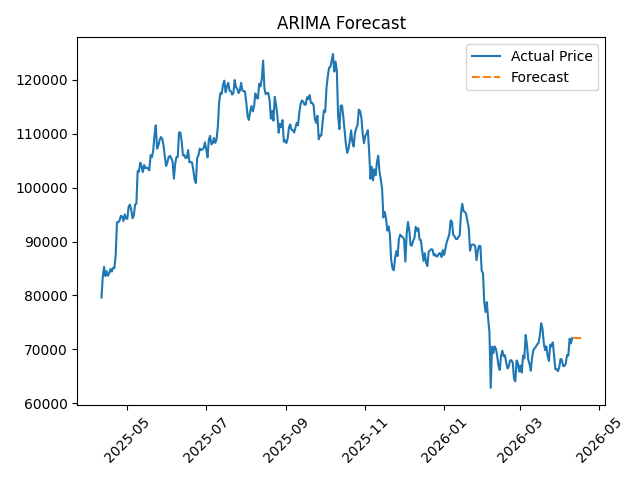

# 📊 Cryptocurrency Time Series Analysis & Forecasting

## 🚀 Overview
This project analyzes cryptocurrency price trends using time series forecasting techniques. It uses the ARIMA model to predict future Bitcoin prices based on historical data.

---

## 🔧 Features
- 📥 Data collection using CoinGecko API  
- 🧹 Data preprocessing and cleaning  
- 📊 Exploratory Data Analysis (EDA)  
- 🔮 ARIMA forecasting model  
- 📉 Model evaluation using RMSE  
- 📊 Dashboard visualization using charts  

---

## 📊 Dashboard

This dashboard provides a visual summary of trends, patterns, and predictions.


---

## 📈 Visualizations

### Price Trend


### Moving Average


### Price Distribution


### Forecast


---

## 🛠 Tech Stack
- Python  
- Pandas, NumPy  
- Matplotlib, Seaborn  
- Statsmodels (ARIMA)  

---

## ▶️ How to Run

```bash
python src/data_collection.py
python src/preprocessing.py
python src/eda.py
python src/arima_model.py
python src/evaluate.py